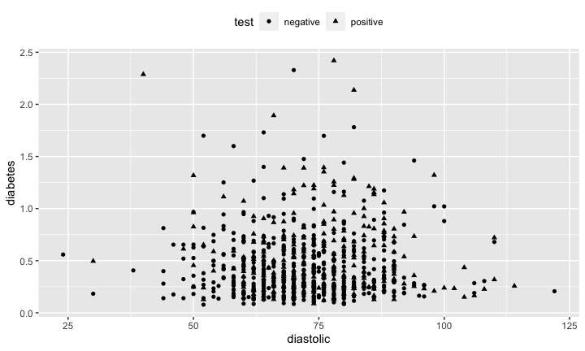

<script src="https://ajax.googleapis.com/ajax/libs/jquery/1.12.2/jquery.min.js"></script>

<script>
    $(document).ready(function() {
    $('slide:not(.title-slide, .backdrop, .segue)').append('<footer></footer>');    
    $('footer').attr('url', "https://math5387.web.app");

  })
</script>


<style>
pre {
    display: block;
    font-family: monospace;
    white-space: pre;
    margin: 1em 0px;
    margin-top: 0em;
    margin-right: 0px;
    margin-bottom: -0.2em;
    margin-left: 0px;
}
footer:after {
    font-size: 12pt;
    content: attr(url);
    position: absolute;
    bottom: 5px;
    right: 60px;
    line-height: 1.9;
    display: block;
  }
slides > slide {
  font-family: 'Open Sans', Arial, sans-serif;
  font-size: 26px;
  color: #797979;
  width: 900px;
  height: 700px;
  margin-left: -450px;
  margin-top: -350px;
  padding: 0px 60px;
  -webkit-border-radius: 5px;
  -moz-border-radius: 5px;
  -ms-border-radius: 5px;
  -o-border-radius: 5px;
  border-radius: 5px;
  -webkit-transition: all 0.6s ease-in-out;
  -moz-transition: all 0.6s ease-in-out;
  -o-transition: all 0.6s ease-in-out;
  transition: all 0.6s ease-in-out;
}
slides > slide > hgroup + article {
  margin-top: 5px;
}
</style>


## Types of Relationships

1. Deterministic or Functional Relationship
2. Statistical Relationship

## Deterministic Relationship

Consider relationship between temperature in degrees Celsius $(C)$ and temperature in degrees Fahrenheit $(F)$
 $$F=\frac{9}{5}C+32$$


## Statistical Relationships

1. Not an exact relationship
2. A relationship in which <span style="color: red;">trend</span> exists between $x$ and $y$


## Statistics analysis

1.	Starts with a problem or question of interest
2.	Proceeds with the collection of relevant data
3.	Continues with the analysis the collected data
4.	Ends with conclusion and interpretation of the results.

The formulation of a problem is often more essential than its solution which may be merely a matter of mathematical or experimental skill.   Albert Einstein


## Problem Formulation

-	Understand the physical background.
    +	Statisticians often work in collaboration with others and need to understand something about the subject area.
-	Understand the objective.
    -	What are your goals?
    -	Make sure you know what the client wants.
-	Put the problem into statistical terms.
    -	This is often the most challenging step and where irreparable errors are sometimes made.
    -	That a statistical method can read in and process the data is not enough. The results of an inapt analysis may be meaningless.


## Essentials of R

What is R?

-	R is free statistical software.
-	R is a programming language.
    -	It is an open source implementation of the S programming language.
    -	It is highly extendable. Users can write functions and easily add software libraries to R.
    -	It is interactive. You type what you want and get out the corresponding results.


## Help

There are many ways to get help for R:

-	If you know the command you want help for, from the command line type:
    -	`help(command)`
        -	E.g., `help(lm)`
        -	`?command`
        -	E.g., `?lm`
-	If you only know the topic you want help for, from the command line type:
    -	`??topic`
    -	E.g., `??logarithm`
    
## Data Structure
R operates on data structures.  A data structure is simply some sort of “container” that holds certain kinds of information.

Common R data structures:

-	Vector (a sequence of numerical, character, factor, or logical data).
-	Matrices (multi-dimensional collection of vectors of the same type)
-	Data Frame (multi-dimensional collection of possibly different data types)
-	List (an ordered collection of possibly different data types)

## Vector

A vector is a sequence of values of the same data type.

The c function (concatenate) can be used to join data from end to end to create vectors.

-	`c(1, 2, 5.3, 6, -2, 4)`
-	`c(“one”, “two”, “three”)`
-	`c(TRUE, TRUE, FALSE, TRUE)`

## The `seq` function


```r
seq(1,10)
```

```
##  [1]  1  2  3  4  5  6  7  8  9 10
```


```r
1:10
```

```
##  [1]  1  2  3  4  5  6  7  8  9 10
```


```r
seq(1, 20, by = 2)
```

```
##  [1]  1  3  5  7  9 11 13 15 17 19
```


```r
seq(1, 2, len = 8)
```

```
## [1] 1.000000 1.142857 1.285714 1.428571 1.571429 1.714286 1.857143 2.000000
```


## The `rep` function

The rep function (replicate) can be used to create a vector by replicate values.

-	Repeat the sequence 1, 2, 3 three times in a row.

```r
	rep(1:3, times = 3)
```

```
## [1] 1 2 3 1 2 3 1 2 3
```
-	Repeat “trt1” once, “trt2” twice, and “trt3” three times.


```r
rep(c("trt1", "trt2", "trt3"), times = 1:3)
```

```
## [1] "trt1" "trt2" "trt2" "trt3" "trt3" "trt3"
```

- Repeat trt1, trt2, trt3 three times each


```r
rep(c('trt1', 'trt2', "trt3"),each =3)
```

```
## [1] "trt1" "trt1" "trt1" "trt2" "trt2" "trt2" "trt3" "trt3" "trt3"
```

## Assignment
-	To store a data structure in the computer’s memory we must assign it to an object or name.
-	Data structures can be stored using the assignment operator “<-” or “=”

```r
	v1 <- 1:5
```

-	To print the data stored in an object, we simply type the variable name into R and hit enter.

```r
	v1
```

```
## [1] 1 2 3 4 5
```

```r
	v2 <- c(1, 10, 11)
	new <- c(v1, v2)
	new
```

```
## [1]  1  2  3  4  5  1 10 11
```

## Logical


```r
x = seq(0,10)
x > 5
```

```
##  [1] FALSE FALSE FALSE FALSE FALSE FALSE  TRUE  TRUE  TRUE  TRUE  TRUE
```

```r
x[3]
```

```
## [1] 2
```

```r
x[3] == 2
```

```
## [1] TRUE
```

## Floating point arithmetic


```r
y = seq(0,1,0.1)
y[5]==0.4
```

```
## [1] TRUE
```

```r
y[9]==0.8
```

```
## [1] TRUE
```

```r
y[4]==0.3
```

```
## [1] FALSE
```

```r
y[4]
```

```
## [1] 0.3
```

```r
sprintf("%.10f",y[4])
```

```
## [1] "0.3000000000"
```

```r
sprintf("%.20f",y[4])
```

```
## [1] "0.30000000000000004441"
```

## Categorical data

Categorical data should be stored as a factor in R.

-	The factor function takes vectors of any data type and converts them to factors.
-	Examples:


```r
	f1 <- factor(rep(1:6, times = 3))
	f1
```

```
##  [1] 1 2 3 4 5 6 1 2 3 4 5 6 1 2 3 4 5 6
## Levels: 1 2 3 4 5 6
```

```r
	f2 <- factor(c("a", 7, "blue", "blue"))
	f2
```

```
## [1] a    7    blue blue
## Levels: 7 a blue
```


## Commonly-used Functions


```r
  x <- seq(0,10)
	length(x) #length of x
```

```
## [1] 11
```

```r
	sum(x) #sum elements in x
```

```
## [1] 55
```

```r
	mean(x) #mean of elements in x
```

```
## [1] 5
```

```r
	var(x) #sample variance of elements in x
```

```
## [1] 11
```

```r
	sd(x) #standard deviation of elements in x
```

```
## [1] 3.316625
```

## Commonly-used Functions


```r
  x <- seq(0,10)
	range(x) #range of elements in x
```

```
## [1]  0 10
```

```r
	log(x) #ln of elements in x
```

```
##  [1]      -Inf 0.0000000 0.6931472 1.0986123 1.3862944 1.6094379 1.7917595
##  [8] 1.9459101 2.0794415 2.1972246 2.3025851
```

```r
	summary(x) #6-number summary of x
```

```
##    Min. 1st Qu.  Median    Mean 3rd Qu.    Max. 
##     0.0     2.5     5.0     5.0     7.5    10.0
```

## Functions related to statistical distributions

Suppose that a random variable X has the “dist” distribution

*	`p[dist](q, …)` – returns the cdf of X evaluated at q, i.e., p=Pra(X≤q).
*	`q[dist](p, …)` – returns the inverse cdf (or quantile function) of X evaluated at p, i.e., $q = \inf \{x:Pr(X\leq x)\geq p\}$
*	`d[dist](x, …)` – returns the mass or density of $X$  evaluated at $x$ (depending on whether it’s discrete or continuous).
*	`r[dist](n, …)` – returns an i.i.d. random sample of size $n$ having the same distribution as $X$. 
*	… indicates that additional arguments describing the shape of the distribution.

## Examples

- `pnorm(1.96, mean = 0, sd = 1)` returns the probability that a normal random variable with mean 0 and standard deviation 1 is less than or equal to 1.96.
- `qunif(0.6, min =0, max = 1)` returns the value x such that $P(X\leq x)=0.6$ for a uniform random variable on the interval [0, 1].
	
- `dbinom(2, size = 20, prob = .2)` returns the probability that $Pra(X=2)$ for $X\sim \text{Binom}(n=20,\theta=0.2)$.

- `dexp(1, rate = 2)` returns the density of an exponential random variable with mean = 1/2.

- `rchisq(100, df = 5)` returns a sample of 100 observations from a chi-squared random variable with 5 df.

## Data Frames

-	Date frames are created by passing vectors into the `data.frame` function.
    -	The names of the columns in the data frame are the names of the vectors you give the `data.frame` function.

```r
    	d <- c(1, 2, 3, 4)
    	e <- c("red", "white", "blue", NA)
    	f <- c(TRUE, TRUE, TRUE, FALSE)
    	mydataframe <- data.frame(d,e,f) 
    	mydataframe
```

```
##   d     e     f
## 1 1   red  TRUE
## 2 2 white  TRUE
## 3 3  blue  TRUE
## 4 4  <NA> FALSE
```

## Data Frames

The columns of a data frame can be renamed using the names function on the data frame.

```r
	names(mydataframe) <- c("ID", "Color", "Passed")
	mydataframe
```

```
##   ID Color Passed
## 1  1   red   TRUE
## 2  2 white   TRUE
## 3  3  blue   TRUE
## 4  4  <NA>  FALSE
```

The columns of a data frame can be named when you are first creating the data frame by using “name =” for each vector of data.

```r
	dataframe2 <- data.frame(ID=d, Color=e, Passed=f)
	dataframe2
```

```
##   ID Color Passed
## 1  1   red   TRUE
## 2  2 white   TRUE
## 3  3  blue   TRUE
## 4  4  <NA>  FALSE
```

## Data Frames

The vectors of a data frame may be accessed using “$” and specifying the name of the desired vector.

```r
	mydataframe$Color
```

```
## [1] "red"   "white" "blue"  NA
```
The vectors of a data frame may be accessed by specifying the desired row(s) or column(s) in square brackets.

```r
	mydataframe[1,]
```

```
##   ID Color Passed
## 1  1   red   TRUE
```

```r
  mydataframe[,3]
```

```
## [1]  TRUE  TRUE  TRUE FALSE
```

## Data Frames
Access the ID column of dataframe2 and assign it to newID

```r
	newID <- dataframe2$ID
```

Create a new ID column within the dataframe2

```r
  dataframe2$ID_new <- paste('Bird_',dataframe2$ID,sep = '')
dataframe2
```

```
##   ID Color Passed ID_new
## 1  1   red   TRUE Bird_1
## 2  2 white   TRUE Bird_2
## 3  3  blue   TRUE Bird_3
## 4  4  <NA>  FALSE Bird_4
```

## Importing Data

-	The read.table function imports data into R as a data frame.
-	Usage: 
`read.table(file, header = TRUE, sep = ",")`
-	file is the file path and name of the file you want to import into R
    -	If you don’t know the file path, set `file = file.choose()` will bring up a dialog box asking you to locate the file you want to import.

## `header` option

-	`header` specifies whether the data file has a header (labels for each column of data in the first row of the data file).
    -	If you don't specify this option in R or use `header=FALSE`, then R will assume the file doesn't have any headings.
    -	`header=TRUE` tells R to read in the data as a data frame with column names taken from the first row of the data file.

## `sep` option

-	`sep` specifies the delimiter separating elements in the file.
    -	If each column of data in the file is separated by a space, then use `sep = " "`
    -	If each column of data in the file is separated by a comma, then use `sep = ","`
    -	If each column of data in the file is separated by a tab, then use `sep = "\t"`.

Note that the `read_table` function in the `readr` package and the `fread` function in the `data.table` package are perhaps better ways of reading in tabular data and use similar syntax.

## Accessing Elements of a Data Structure

-	Subsets of the elements of a vector may be selected by appending to the name of the vector an index vector in square brackets.
  -	

```r
	a <- seq(2, 16, by = 2)
	a
```

```
## [1]  2  4  6  8 10 12 14 16
```

```r
	a[c(2, 4, 6)] #Access the 2nd, 4th, and 6th elements of a.
```

```
## [1]  4  8 12
```

```r
	a[-c(2, 4, 6)] #Access all elements in a EXCEPT the 2nd, 4th, and 6th.
```

```
## [1]  2  6 10 14 16
```

```r
	a[-(3:6)] #Access all elements in a except elements 3 through 6.
```

```
## [1]  2  4 14 16
```


## Logical operations

Sometimes we need to know if the elements of an object satisfy certain conditions.  This can be determined using the logical operators <, <=, >, >=, ==, !=

-	“==” means “equal to” and “!=” means not equal to.

```r
a <- sample(0:99,10)
a
```

```
##  [1] 99 91 77 78 62  4 53 38 75 92
```

```r
a>50 
```

```
##  [1]  TRUE  TRUE  TRUE  TRUE  TRUE FALSE  TRUE FALSE  TRUE  TRUE
```

```r
a[a>50] #values of a greater than 50
```

```
## [1] 99 91 77 78 62 53 75 92
```

```r
a[a<=40] #values of a less than or equal to 40
```

```
## [1]  4 38
```

## Logical operations


```r
a==10 #Is there 10?
```

```
##  [1] FALSE FALSE FALSE FALSE FALSE FALSE FALSE FALSE FALSE FALSE
```

```r
sum(a==10)
```

```
## [1] 0
```

```r
10%in%a
```

```
## [1] FALSE
```

## Logical operations

-	More complicated logical arguments can be made using `&` and `|`.
    -	& means "and"
    -	| means "or"


```r
(a > 50) & (a <= 90) #Elements of a greater than 50 and less than or equal to 90
```

```
##  [1] FALSE FALSE  TRUE  TRUE  TRUE FALSE  TRUE FALSE  TRUE FALSE
```

```r
a[(a > 50) & (a <= 90)]
```

```
## [1] 77 78 62 53 75
```

```r
a[(a <= 30) | (a>=70)]
```

```
## [1] 99 91 77 78  4 75 92
```

## Other data management options

Note:  There is now a debate about the proper approach to organizing and working with data.

We will typically work with base R.

-	These are the commands and functions R offers by default.

The `tidyverse` (www.tidyverse.org) is a collection of R packages that provides a unified framework for data manipulation and visualization.

-	This is becoming extremely popular.
-	Since this course is focuses more on modeling than data manipulation (though we will have to do this), I will typically only use functions from the tidyverse when it greatly simplifies analysis, data manipulation, or visualization.

## Sample Data Analysis in R

Calculate numerical summaries:

-	means
-	standard deviations (SDs)
-	maximum and minimum, correlations
-	anything else that may be appropriate.

Construct the appropriate plots.

-	For one quantitative variable: boxplots, histograms, density plots, etc.
-	For two quantitative variables: scatterplots.
-	For three or more variables, construct interactive and dynamic graphics.

## Kidney Example

The National Institute of Diabetes and Digestive and Kidney Diseases conducted a study on 768 adult female Pima Indians living near Phoenix. The following variables were recorded: number of times pregnant, plasma glucose concentration at 2 hours in an oral glucose tolerance test, diastolic blood pressure (mmHg), triceps skin fold thickness (mm), 2-hour serum insulin (mu U/ml), body mass index (weight in kg/(height in m2)), diabetes pedigree function, age (years) and a test whether the patient showed signs of diabetes (coded zero if negative, one if positive). The data may be obtained from the UCI Repository of machine learning databases at archive.ics.uci.edu/ml.

## Load data

```r
data(pima, package = "faraway")
str(pima)
```

```
## 'data.frame':	768 obs. of  9 variables:
##  $ pregnant : int  6 1 8 1 0 5 3 10 2 8 ...
##  $ glucose  : int  148 85 183 89 137 116 78 115 197 125 ...
##  $ diastolic: int  72 66 64 66 40 74 50 0 70 96 ...
##  $ triceps  : int  35 29 0 23 35 0 32 0 45 0 ...
##  $ insulin  : int  0 0 0 94 168 0 88 0 543 0 ...
##  $ bmi      : num  33.6 26.6 23.3 28.1 43.1 25.6 31 35.3 30.5 0 ...
##  $ diabetes : num  0.627 0.351 0.672 0.167 2.288 ...
##  $ age      : int  50 31 32 21 33 30 26 29 53 54 ...
##  $ test     : int  1 0 1 0 1 0 1 0 1 1 ...
```

## Data head and tail


```r
head(pima)
```

```
##   pregnant glucose diastolic triceps insulin  bmi diabetes age test
## 1        6     148        72      35       0 33.6    0.627  50    1
## 2        1      85        66      29       0 26.6    0.351  31    0
## 3        8     183        64       0       0 23.3    0.672  32    1
## 4        1      89        66      23      94 28.1    0.167  21    0
## 5        0     137        40      35     168 43.1    2.288  33    1
## 6        5     116        74       0       0 25.6    0.201  30    0
```

```r
tail(pima)
```

```
##     pregnant glucose diastolic triceps insulin  bmi diabetes age test
## 763        9      89        62       0       0 22.5    0.142  33    0
## 764       10     101        76      48     180 32.9    0.171  63    0
## 765        2     122        70      27       0 36.8    0.340  27    0
## 766        5     121        72      23     112 26.2    0.245  30    0
## 767        1     126        60       0       0 30.1    0.349  47    1
## 768        1      93        70      31       0 30.4    0.315  23    0
```


## Data entry errors

The `summary` command is a quick way to get the usual univariate summary information.

-	Look for anything unusual or unexpected, perhaps indicating a data-entry error.
-	The minimum blood pressure is zero!  (That’s generally an indication of a problem).


```r
sort(pima$diastolic)
```

```
##   [1]   0   0   0   0   0   0   0   0   0   0   0   0   0   0   0   0   0   0
##  [19]   0   0   0   0   0   0   0   0   0   0   0   0   0   0   0   0   0  24
##  [37]  30  30  38  40  44  44  44  44  46  46  48  48  48  48  48  50  50  50
##  [55]  50  50  50  50  50  50  50  50  50  50  52  52  52  52  52  52  52  52
##  [73]  52  52  52  54  54  54  54  54  54  54  54  54  54  54  55  55  56  56
##  [91]  56  56  56  56  56  56  56  56  56  56  58  58  58  58  58  58  58  58
## [109]  58  58  58  58  58  58  58  58  58  58  58  58  58  60  60  60  60  60
## [127]  60  60  60  60  60  60  60  60  60  60  60  60  60  60  60  60  60  60
## [145]  60  60  60  60  60  60  60  60  60  60  60  60  60  60  61  62  62  62
## [163]  62  62  62  62  62  62  62  62  62  62  62  62  62  62  62  62  62  62
## [181]  62  62  62  62  62  62  62  62  62  62  62  62  62  64  64  64  64  64
## [199]  64  64  64  64  64  64  64  64  64  64  64  64  64  64  64  64  64  64
## [217]  64  64  64  64  64  64  64  64  64  64  64  64  64  64  64  64  64  64
## [235]  64  64  65  65  65  65  65  65  65  66  66  66  66  66  66  66  66  66
## [253]  66  66  66  66  66  66  66  66  66  66  66  66  66  66  66  66  66  66
## [271]  66  66  66  68  68  68  68  68  68  68  68  68  68  68  68  68  68  68
## [289]  68  68  68  68  68  68  68  68  68  68  68  68  68  68  68  68  68  68
## [307]  68  68  68  68  68  68  68  68  68  68  68  68  70  70  70  70  70  70
## [325]  70  70  70  70  70  70  70  70  70  70  70  70  70  70  70  70  70  70
## [343]  70  70  70  70  70  70  70  70  70  70  70  70  70  70  70  70  70  70
## [361]  70  70  70  70  70  70  70  70  70  70  70  70  70  70  70  72  72  72
## [379]  72  72  72  72  72  72  72  72  72  72  72  72  72  72  72  72  72  72
## [397]  72  72  72  72  72  72  72  72  72  72  72  72  72  72  72  72  72  72
## [415]  72  72  72  72  72  74  74  74  74  74  74  74  74  74  74  74  74  74
## [433]  74  74  74  74  74  74  74  74  74  74  74  74  74  74  74  74  74  74
## [451]  74  74  74  74  74  74  74  74  74  74  74  74  74  74  74  74  74  74
## [469]  74  74  74  75  75  75  75  75  75  75  75  76  76  76  76  76  76  76
## [487]  76  76  76  76  76  76  76  76  76  76  76  76  76  76  76  76  76  76
## [505]  76  76  76  76  76  76  76  76  76  76  76  76  76  76  78  78  78  78
## [523]  78  78  78  78  78  78  78  78  78  78  78  78  78  78  78  78  78  78
## [541]  78  78  78  78  78  78  78  78  78  78  78  78  78  78  78  78  78  78
## [559]  78  78  78  78  78  80  80  80  80  80  80  80  80  80  80  80  80  80
## [577]  80  80  80  80  80  80  80  80  80  80  80  80  80  80  80  80  80  80
## [595]  80  80  80  80  80  80  80  80  80  82  82  82  82  82  82  82  82  82
## [613]  82  82  82  82  82  82  82  82  82  82  82  82  82  82  82  82  82  82
## [631]  82  82  82  84  84  84  84  84  84  84  84  84  84  84  84  84  84  84
## [649]  84  84  84  84  84  84  84  84  85  85  85  85  85  85  86  86  86  86
## [667]  86  86  86  86  86  86  86  86  86  86  86  86  86  86  86  86  86  88
## [685]  88  88  88  88  88  88  88  88  88  88  88  88  88  88  88  88  88  88
## [703]  88  88  88  88  88  88  90  90  90  90  90  90  90  90  90  90  90  90
## [721]  90  90  90  90  90  90  90  90  90  90  92  92  92  92  92  92  92  92
## [739]  94  94  94  94  94  94  95  96  96  96  96  98  98  98 100 100 100 102
## [757] 104 104 106 106 106 108 108 110 110 110 114 122
```

## Data entry errors
The first 35 values are zero—there’s a problem.  

-	It seems that 0 was used in place of a missing value.
-	This is very bad since 0 is a real number and this problem may be overlooked, which can lead to faulty analysis!
-	This is why we must check our data carefully for things that don’t make sense.

## Assing `NA` for missing data

The value for missing data in R is `NA`.

Several variables share this problem.  Let’s set the 0s that should be missing values to `NA`.


```r
pima$diastolic[pima$diastolic == 0]  <- NA
pima$glucose[pima$glucose == 0] <- NA
pima$triceps[pima$triceps == 0]  <- NA
pima$insulin[pima$insulin == 0] <- NA
pima$bmi[pima$bmi == 0] <- NA
```

## Data class
The variable test is a categorical variable, not numerical.  

-	R thinks it is numerical.
-	In R, a categorical variable is a factor.
-	We need to convert this variable to a factor.


```r
 pima$test <- factor(pima$test)
 summary(pima$test)
```

```
##   0   1 
## 500 268
```

500 of the cases were negative and 268 were positive.  We can provide more descriptive labels using the levels function.


```r
levels(pima$test) <-c("negative","positive")
```

## Ploting Data

A histogram of diastolic blood pressure.

```r
hist(pima$dias,xlab="Diastolic",main="")
```


## What we can tell from the histogram
The histogram is approximately bell-shaped and centered around 70.


```r
hist(pima$dias,xlab="Diastolic",main="", breaks = 20)
```


## Density plot

Many people prefer the density plot over the histogram since the histogram is so sensitive to its options.  

-	A density plot is essentially a smoothed version of a histogram.
-	A “kernel” smoother is used to construct a weighted average of data points and create a smooth surface.

## Density Plot
The density plot isn’t as blocky (though you might see weird things happen at the boundaries).

```r
plot(density(pima$diastolic,na.rm=TRUE),main="")
```


## Plot points

We could simply plot the sorted data against its index.

```r
plot(sort(pima$diastolic),ylab="Sorted Diastolic")
```


## What we see

This plot is most useful for identifying:

-	Possible outliers
-	The discreteness of the data
    -	Are there numerous repeated data values or are they all unique?

```r
plot(sort(pima$diastolic),ylab="Sorted Diastolic")
```


## Bivariate plot

A standard scatterplot of diabetes vs diastolic blood pressure.

```r
plot(diabetes ~ diastolic, data = pima)
```


## Bivariate plot
A parallel boxplot of diabetes vs test result.

```r
plot(diabetes ~ test, data = pima)
```


## Side by side plots

```r
par(mfrow=c(1,2))
plot(diabetes ~ diastolic, data = pima)
plot(diabetes ~ test, data = pima)
```


## `ggplot2`

The plots we have just created are using the base graphics system in R.
-	These are very fast, simple, and professional.

A fancier alternative is to construct plots using the `ggplot2` package.

In its simplest form, `ggplot2` requires you to provide:

-	A ggplot object that includes the data frame holding the data.
-	A mapping arguments that specifies the plot aesthetics (essentially, the data that will be used in the plot).
-	A geometry object that specifies how the aesthetics are used in a plot.

## `ggplot2` example

```r
library(ggplot2)
ggpima  = ggplot(pima, aes(x=diastolic))
ggpima + geom_histogram(aes(x = diastolic))
```


## `ggplot2` example

```r
ggpima + geom_density(aes(x = diastolic))
```


## `ggplot2` example

```r
ggpima + geom_point(aes(x = diastolic, y = diabetes))
```


## Customize `ggplot2` 


```r
ggpima + 
  geom_point(aes(x = diastolic, y = diabetes, shape = test)) + 
  theme(legend.position = "top", legend.direction = "horizontal")
```



## Faceting `ggplot2` 


```r
ggpima + geom_point(aes(x = diastolic, y = diabetes)) + facet_grid(~ test)
```


## Summary of `ggplot2`

-	You first need to create a ggplot object using the `ggplot` function.  Specify:
    o-	The data frame the data is contained in (e.g., the data frame is `pima`) 
-	Map the **aesthetics** using `aes`.  The aesthetic specifies what you see, such as position in the $x$ or $y$ direction or aspects such as shape or color.
-	Specify the geometry for the plot (how you want to map the aesthetics).
-	The advantage of `ggplot2` is more apparent in producing more complex plots involving more than just two variables.
-	A `theme` specifies options for the appearance of the plot.
-	We specified where the `legend` should appear in one plot and to use more than one panel (`facets`) in another. 

# When to Use Linear Modeling
## Linear Models

Linear models are used to model the relationship between a:

- single variable $Y$, called the **response, outcome, output, or dependent** variable and
-	one or more **predictor, input, independent, or explanatory** variables.

Note:  the descriptions of independent and dependent variables are vague and are best avoided.  

**Regression analysis** is another term for linear modeling, although regressions can be nonlinear.

## Terminology and Assumptions

- When we have one constant predictor and one non-constant predictor, we are doing simple regression.  
- When we have more than one non-constant predictor we are doing multiple regression. 
- When we have more than one response, we are doing multivariate regression.

Assumptions of linear models:
- Y is (approximately) continuous
- Predictors can be continuous, discrete, or categorical.

## More terminology
-	A regression with one quantitative predictor and one qualitative predictor is an **analysis of covariance (ANCOVA)**.
-	A regression with all qualitative predictors is an **analysis of variance (ANOVA)**.
  -	A regression with a qualitative response will typically utilize **logistic** regression.
  -	Responses that do not have a normal distribution are modeled using **generalized linear models (GLMs)**.


## Goals of regression

1.	Prediction of future or unseen responses given specified values of the predictors.
2.	Assessments of the effect of, or relationship between, explanatory variables and the response.  We would like to infer causal relationships if possible.

Be clear of your objective!  Your choice of analysis may differ depending on the objective.

There is generally no **true** model.  We simply want to find a model that adequately describes the relationship between relevant explanatory variables, allows us to make good predictions, infer causality, etc.


# More discussion on scatterplots

## Height example
Scatterplots are a convenient way to study the dependence between a single response and a single predictor variable.

**Inheritance of Height**

Karl Pearson (1857-1936) organized the collection of n=1375 heights of mothers in the United Kingdom under the age of 65 and one of their adult daughters over the age of 18.  We are interested in the inheritance from the mother to the daughter, so the mother’s height (mheight) is used as the predictor variable and the daughter’s height (dheight) is used as the response variable.

## Heritability
Do taller mothers tend to have taller daughters?  Do shorter mothers tend to have shorter daughters?


```r
library(alr3)
data(heights)
M = heights$Mheight
D = heights$Dheight
plot(M, D, pch = 23, bg = "red", cex = 2, xlab = "Mother's height (in)", ylab = "Daughter's height (in)")
```


## What the plot says

- Notice that since the range of the measurements are roughly the same for the two variables, we use the same scale for the x and y-axis.  

- There is a clear linear relationship between the heights of mothers and daughters.

- Notice that there are more points in the center of the data, and fewer points along the edges.  This is typical for biological data.


## Car data

The data give the speed of cars and the distances taken to stop. Note that the data were recorded in the 1920s.


```r
data(cars)
names(cars)
```

```
## [1] "speed" "dist"
```

```r
plot(cars$speed, cars$dist, xlab = 'Speed (mph)', ylab = 'Stopping distance (ft)')
abline(lm(dist~speed, data = cars), col = 'red')
abline(a = mean(cars$dist), b=0)
legend('topleft',c('OLS', 'Mean dist'), lty = 1, col = c('red','black'))
```


# Mean Functions

## Mean Function

We are frequently interested in how the distribution of the response varies with changes in the predictor variable.

The **mean function** is particularly important, and we define it by the relationship 

$E(Y│X=x)=a$ function the depends on the value of x.

We read this as the "expected value of the response when the predictor is fixed at the value $X=x$"


## Mean Function
For example, in the Heights data, we might believe that 

$E(dheight│mheight=x)=β_0+β_1 x$,

that is, the mean function is a straight line.

The particular mean function has two parameters, an intercept $\beta_0$ and a slope $\beta_1$.

If we knew the values of the $\beta$s, then the mean function would be completely known. In practice, these must be estimated from the data.

If the response variable and the predictor variable are independent (have no relationship), then $\beta_1=0$. We will learn how to test this hypothesis later. 

 
